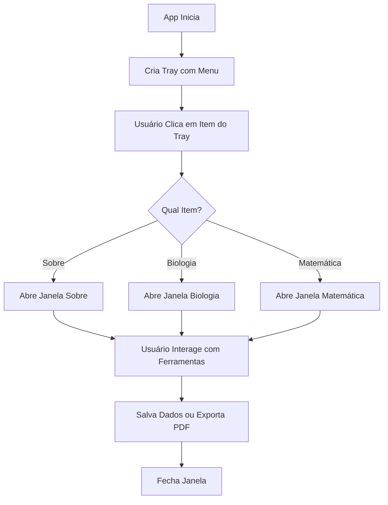

# Winsdom Desktop

Winsdom Desktop é um aplicativo de desktop focado em simplificar matérias complexas com ferramentas dinâmicas de visualização e cálculo. Desenvolvido com Electron, oferece módulos para Matemática, Biologia, e em breve Física & Química e Geografia & História.

## Descrição

O Winsdom Desktop transforma o estudo passivo em uma experiência ativa e tecnológica. Utilizando uma interface intuitiva baseada em quadros brancos digitais, mapas mentais e calculadoras simbólicas, o aplicativo auxilia estudantes a compreender conceitos de forma interativa.

## Funcionalidades

### Matemática

- **Quadro Branco Digital**: Desenhe, escreva e insira equações LaTeX (KaTeX).
- **Calculadora Simbólica**: Realize cálculos avançados com MathJS e Algebrite.
- **Visualização de Funções**: Plote gráficos com D3.js e Function Plot.
- **Exportação para PDF**: Salve seus trabalhos diretamente.

### Biologia

- **Mapas Mentais**: Crie e edite mapas mentais interativos.
- **Flashcards**: Gerencie cartões de estudo para memorização.
- **Quadro Branco**: Anote e desenhe estruturas biológicas.
- **Glossário Técnico**: Acesso rápido a termos biológicos.

### Em Breve

- **Física & Química**: Simuladores de colisões, circuitos e tabela periódica interativa.
- **Geografia & História**: Mapas temporais e análise geopolítica.

## Instalação

### Pré-requisitos

- Node.js (versão 14 ou superior)
- npm ou yarn

### Passos

1. Clone o repositório:

   ```bash
   git clone https://github.com/OlluaS-code/Winsdom_Desktop_APK.git
   cd Winsdom_Desktop_APK
   ```

2. Instale as dependências:

   ```bash
   npm install
   ```

3. Execute em modo desenvolvimento:

   ```bash
   npm start
   ```

4. Para construir o instalador:
   ```bash
   npm run dist
   ```

## Uso

O aplicativo roda na bandeja do sistema. Clique com o botão direito no ícone da bandeja para acessar:

- **Sobre**: Informações sobre o aplicativo e o desenvolvedor.
- **Biologia**: Abra o módulo de Biologia.
- **Matemática**: Abra o módulo de Matemática.

Cada módulo oferece ferramentas específicas acessíveis via menus ou botões de navegação.

## Tecnologias Utilizadas

- **Electron**: Framework para aplicações desktop multiplataforma.
- **HTML/CSS/JavaScript**: Interface do usuário.
- **MathJax/KaTeX**: Renderização de equações matemáticas.
- **D3.js**: Visualização de dados e gráficos.
- **Tailwind CSS/Bootstrap**: Estilização.
- **Lucide Icons**: Ícones vetoriais.

## Fluxo Principal da Aplicação



## Contribuição

Contribuições são bem-vindas! Sinta-se à vontade para abrir issues ou pull requests no [repositório GitHub](https://github.com/OlluaS-code/Winsdom_Desktop_APK).

## Licença

Este projeto está licenciado sob a Licença MIT. Veja o arquivo LICENSE para mais detalhes.

## Autor

Desenvolvido por **Saullo Moura Tavares** (OlluaS-code).  
Portfólio: [olluas-code.github.io](https://olluas-code.github.io/)  
GitHub: [github.com/OlluaS-code](https://github.com/OlluaS-code)

---

© 2026 Winsdom Desktop App. Desenvolvido com foco em performance e clareza.</content>
<parameter name="filePath">c:\Users\smour\Desktop\Winsdom_Desktop_APK\README.md
